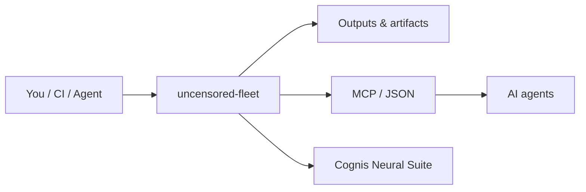

<a name="top"></a>
<div align="center">


# uncensored-fleet

### Deploy a local multi-model LLM fleet in one command — llama.cpp slots, an agent harness, and [engram](https://github.com/cognis-digital/engram) memory.

[](LICENSE)   [](https://github.com/cognis-digital/cognis-neural-suite)

*Your hardware. Your models. No API keys, no rate limits, nothing leaves the box.*

</div>

```bash
pip install "git+https://github.com/cognis-digital/uncensored-fleet.git"
bash scripts/build-llamacpp.sh     # build the engine (CUDA/Metal/Vulkan auto)
fleet pull all                     # download the model fleet
fleet up uncensored                # start the commander slot
fleet agent "summarize ./notes and propose next steps"
```

<!-- cognis:layman:start -->
## What is this?

uncensored-fleet lets you run several AI language models at the same time on your own computer, without needing an internet connection or paying for any cloud service. You control which models are running, send them prompts, and even have them work together on longer tasks — all through a simple `fleet` command. It is designed for developers and researchers who want private, unrestricted AI assistants that run entirely on their own hardware.
<!-- cognis:layman:end -->

## Contents
- [Why](#why) · [The fleet](#the-fleet) · [Quick start](#quick-start) · [The harness](#the-harness) · [Engram memory](#engram-memory) · [Explore the suite](#explore-the-suite)

<a name="why"></a>
## Why

Cloud LLMs gate you on price, rate limits, and content policy. `uncensored-fleet` stands up a **fleet of
local models** — reasoning, math, coding, vision, and an **abliterated "commander"** — each served by
llama.cpp on your own GPU, and gives you a **model-agnostic agent harness** to drive them. It is the
deployment layer for a private, unrestricted, self-improving local AI stack.

<div align="right"><a href="#top">↑ back to top</a></div>

<a name="the-fleet"></a>
## The fleet

| Slot | Role | Default model | Port |
|---|---|---|---|
| `reasoning` | planning / analysis | DeepSeek-R1-Distill-Qwen-7B | 8771 |
| `math` | SymPy-verifiable problems | Qwen2.5-Math-7B | 8772 |
| `coding` | code gen + edits | Qwen2.5-Coder-7B | 8773 |
| `vision` | image / OCR | Qwen2-VL-7B | 8775 |
| `uncensored` | **commander**, unrestricted | Josiefied-Qwen3-8B-abliterated | 8774 |

VRAM-aware: conflicting slots auto-evict. Override any slot in `fleet.yaml`.

<a name="quick-start"></a>
<!-- cognis:install:start -->
## Install

`uncensored-fleet` is source-available (not published to PyPI) — every method below installs
straight from GitHub. Pick whichever you prefer; the one-line scripts auto-detect
the best tool available on your machine.

**One-liner (Linux / macOS):**
```sh
curl -fsSL https://raw.githubusercontent.com/cognis-digital/uncensored-fleet/HEAD/install.sh | sh
```

**One-liner (Windows PowerShell):**
```powershell
irm https://raw.githubusercontent.com/cognis-digital/uncensored-fleet/HEAD/install.ps1 | iex
```

**Or install manually — any one of:**
```sh
pipx install "git+https://github.com/cognis-digital/uncensored-fleet.git"     # isolated (recommended)
uv tool install "git+https://github.com/cognis-digital/uncensored-fleet.git"  # uv
pip install "git+https://github.com/cognis-digital/uncensored-fleet.git"      # pip
```

**From source:**
```sh
git clone https://github.com/cognis-digital/uncensored-fleet.git
cd uncensored-fleet && pip install .
```

Then run:
```sh
fleet --help
```
<!-- cognis:install:end -->

## Quick start

```bash
fleet models                 # list slots
fleet pull all               # download GGUFs (huggingface_hub / hf-cli / direct)
fleet up all                 # start servers (or: fleet up coding)
fleet status                 # see what's live
fleet run coding "write a python LRU cache"
fleet agent "audit ./repo for secrets and write FINDINGS.md" --slot uncensored
fleet down                   # stop everything
```

<a name="the-harness"></a>
## The harness

A tiny, dependency-free agent loop (`fleet/harness.py`) talks to any slot over the llama.cpp
OpenAI-compatible endpoint and supports safe tools (`run_bash`, `read_file`, `write_file`) via a simple
`TOOL::` / `FINAL::` text protocol — model-agnostic, so it works with whatever you load.

<a name="engram-memory"></a>
## Engram memory

The harness remembers. It uses the Cognis **[engram](https://github.com/cognis-digital/engram)** fork for
portable, model-agnostic long-term memory when installed (`pip install "cognis-uncensored-fleet[engram]"`),
and falls back to a local SQLite store otherwise. Every task's outcome is recalled on the next related run.

<a name="explore-the-suite"></a>
## Explore the Cognis Neural Suite

`uncensored-fleet` is the local-AI backbone of the **[Cognis Neural Suite](https://github.com/cognis-digital/cognis-neural-suite)** (170+ tools). Pair it with:

- 🧠 **[engram](https://github.com/cognis-digital/engram)** — model-agnostic agent memory
- 🛠️ **[skills](https://github.com/cognis-digital/skills)** — agent skill registry the harness can load
- 🤖 **[agentsmith](https://github.com/cognis-digital/agentsmith)** · **[evalbench](https://github.com/cognis-digital/evalbench)** · **[modelroute](https://github.com/cognis-digital/modelroute)** — orchestrate, evaluate, route
- 📚 **[awesome-cognis](https://github.com/cognis-digital/awesome-cognis)** · **[cognis-sources](https://github.com/cognis-digital/cognis-sources)** — the full index

## Responsible use
Local, unrestricted models are powerful. Use them lawfully and ethically; you are responsible for what you generate and run.

## How it fits



**Explore the suite →** [🗂️ all tools](https://github.com/cognis-digital/cognis-neural-suite) · [⭐ awesome-cognis](https://github.com/cognis-digital/awesome-cognis) · [🔗 cognis-sources](https://github.com/cognis-digital/cognis-sources)

<a name="verification"></a>
## Verification

[](AUDIT.md)

Every push is verified end-to-end. Latest audit (2026-06-13):

```text
tests        : 2 passed, 0 failed, 0 errored
compile      : all modules parse
cli          : C:\Python314\python.exe: No module named https
package      : https
```

<details><summary>CLI surface (<code>--help</code>)</summary>

```text
C:\Python314\python.exe: No module named https
```
</details>

Full machine-readable results: [`AUDIT.md`](AUDIT.md) · regenerate with `python -m https --help` + `pytest -q`.

<div align="right"><a href="#top">↑ back to top</a></div>


## License
Source-available under the **Cognis Open Collaboration License (COCL) v1.0** — see [LICENSE](LICENSE). Commercial use: licensing@cognis.digital.

---
<div align="center"><sub><b><a href="https://cognis.digital">Cognis Digital</a></b> · part of the <a href="https://github.com/cognis-digital/cognis-neural-suite">Cognis Neural Suite</a> · <i>Making Tomorrow Better Today</i></sub></div>
